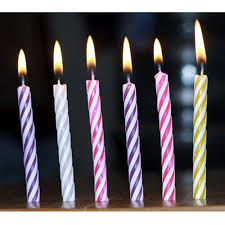

# About question 
In this I  had made one function named birthdayCakeCandles.
Then i took a user input for the elements i want in an array.
Then I have made another function max find the maximum number from that array.

Then I applied loop to find the count of the maximum number.
